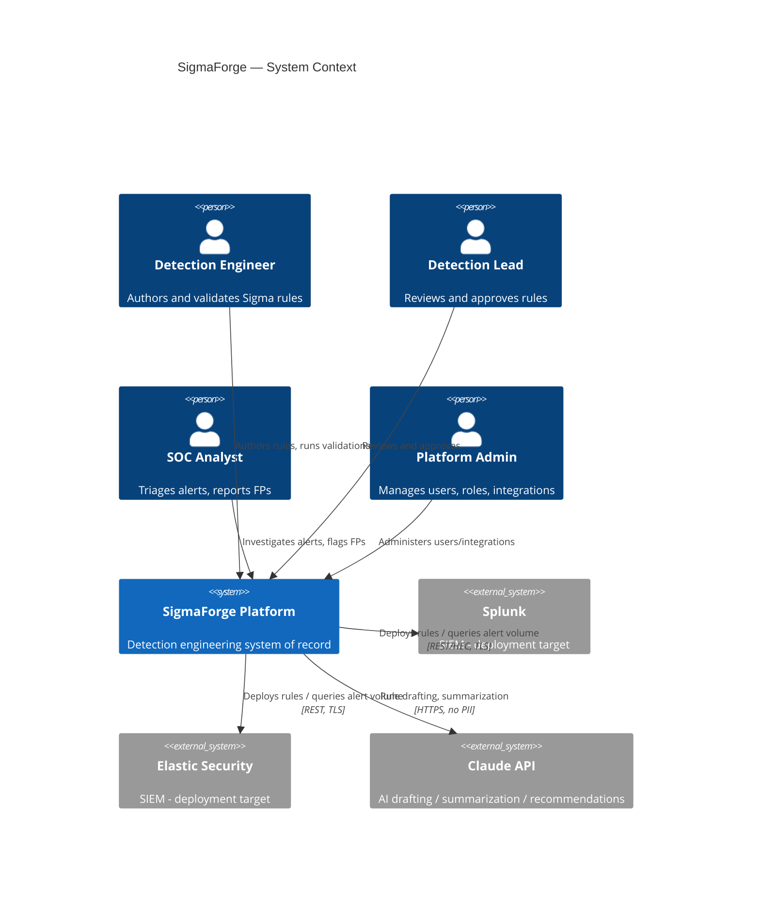
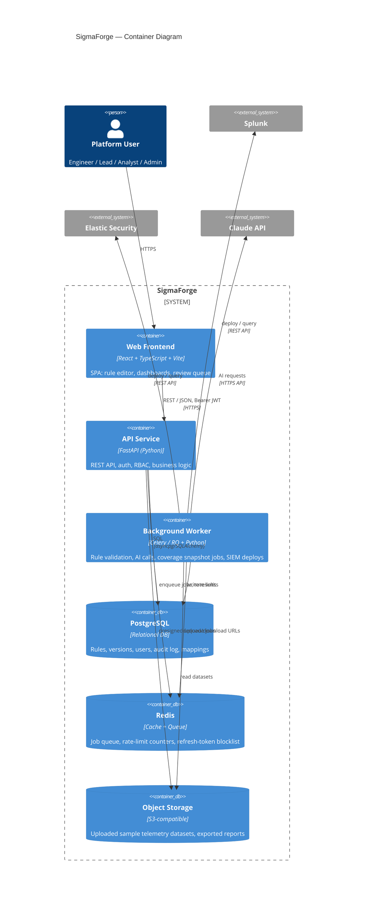
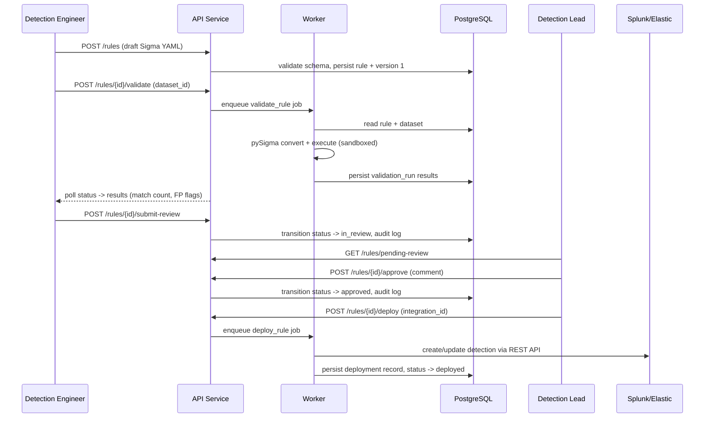
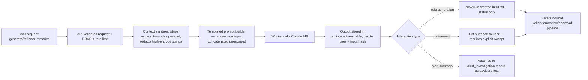
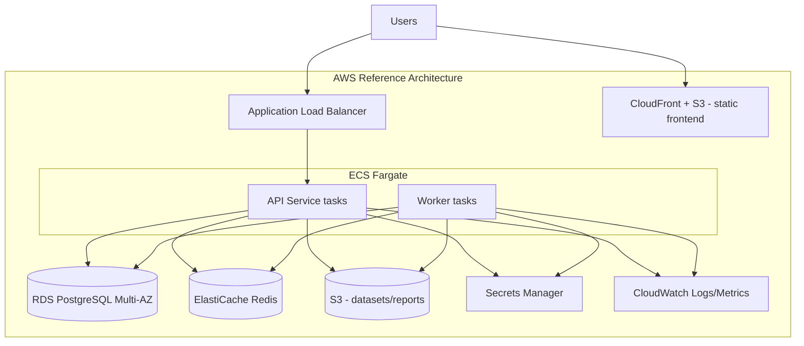
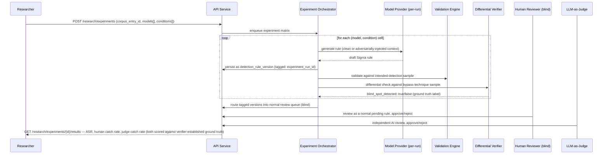

# System Architecture

**Product:** SigmaForge — AI-Assisted Detection Engineering Platform
**Status:** Draft v1.0

> **Implementation status:** this document describes the target
> architecture across all milestones. As of the current release (E0), the
> components that exist and run are: the FastAPI API service (auth +
> health endpoints only), the Postgres database (full schema migrated,
> only the auth tables in active use), the Celery worker (one real
> diagnostic task, `ping`, proving the Redis broker round-trip), and the
> React frontend (login page only). MinIO, the AI assistant, the SIEM
> integrations, and the full research subsystem (§11) described below are
> designed but not yet implemented — see `ROADMAP.md` for when each lands
> and `RELEASE_REPORT.md` for the current, literal state of the repository.

---

## 1. Architectural Principles

1. **AI is a sidecar, not a dependency.** Every core workflow (author, validate, approve, deploy, track FPs) must function with the AI service fully disabled. AI calls are isolated behind a service interface and never sit on the critical path of rule deployment.
2. **Validation never blocks the API.** Running a Sigma-to-query conversion and executing it against a telemetry sample is untrusted, potentially slow work — it always runs in a background worker, never inline in an HTTP request handler.
3. **Nothing bypasses RBAC + audit.** Every mutating endpoint enforces server-side authorization (never client-side only) and writes an audit record. This is non-negotiable for a platform whose entire value proposition is governance.
4. **Secrets never round-trip to the client.** SIEM credentials and API keys are encrypted at rest and are write-only through the API — no read endpoint ever returns a decrypted secret.
5. **Boring, defensible technology choices.** Every component is chosen because it's what a real security engineering org would actually run, not because it's novel.

## 2. System Context (C4 Level 1)

## 3. Container View (C4 Level 2)

## 4. Component Breakdown (API Service)

| Component | Responsibility |
|---|---|
| **Auth module** | Registration (admin-invite only), login, JWT issuance, refresh-token rotation, logout/revocation, password hashing (Argon2) |
| **RBAC module** | Role/permission resolution, dependency-injected `require_permission()` guards on every route |
| **Rule module** | CRUD for detection rules and versions, YAML/Sigma schema validation via `pySigma` on save |
| **Review module** | State machine for `draft → in_review → approved/rejected → deployed → deprecated`, self-approval prevention |
| **MITRE module** | Serves the local ATT&CK dataset, manages rule↔technique mappings, computes coverage |
| **Validation module (API side)** | Accepts validation job requests, enqueues to worker, exposes polling/status endpoint |
| **SIEM integration module** | CRUD for integration profiles (secrets write-only), triggers deploy jobs, stores deployment history |
| **AI module (API side)** | Thin proxy that enqueues AI jobs to the worker with sanitized context; never calls the LLM directly from the request thread |
| **Audit module** | Middleware/decorator that writes an audit record for every mutating request; read-only query API for Admins |
| **Reporting module** | Aggregates data for coverage/risk reports, triggers PDF/CSV export jobs |

## 5. Component Breakdown (Background Worker)

| Job type | Description |
|---|---|
| `validate_rule` | Convert Sigma → target query (pySigma), execute against a stored/uploaded telemetry sample in a sandboxed subprocess with CPU/memory/time limits, persist match results |
| `deploy_rule` | Push an approved rule's converted query to the configured Splunk/Elastic integration via REST API, persist deployment result |
| `ai_generate_rule` | Call Claude API with a sanitized, templated prompt to draft a Sigma rule from a description; persist as a new `draft` rule owned by the requesting user |
| `ai_refine_rule` | Call Claude API with a rule + its FP history to propose a diff; never auto-applies the diff |
| `ai_summarize_alert` | Call Claude API with a redacted alert payload + rule metadata; persist summary against the alert investigation record |
| `compute_coverage_snapshot` | Scheduled (e.g. daily) job that recomputes ATT&CK coverage and rule risk scores, writes a historical snapshot row |
| `generate_report` | Renders CSV/PDF exports and writes them to object storage, returns a presigned download URL |

## 6. Data Flow — Rule Lifecycle (Primary Workflow)

## 7. AI Assistant — Guardrail Architecture

Key point for interviews: **AI output never skips the state machine.** An AI-drafted rule is a `draft` like any other — it still needs validation and human approval before deployment. This directly addresses AI-specific risks (hallucinated logic, prompt injection, overly broad rules) with a control that isn't AI-based at all: the existing governance workflow.

## 8. Deployment Architecture

### 8.1 Local / Repo-Delivered (what actually ships in the repo)

`docker-compose.yml` with services: `frontend`, `api`, `worker`, `postgres`, `redis`, `minio` (S3-compatible object storage for local dev). Single `.env.example` documenting every required variable. This is the environment CI runs integration tests against.

### 8.2 Reference Production Target (documented, not necessarily fully provisioned)

Rationale: ECS Fargate over self-managed EC2/K8s for a single-org internal tool — no cluster ops overhead, scales the API and worker independently, and is a realistic, defensible choice for a small security platform team (vs. over-engineering with EKS for a workload this size). RDS Multi-AZ and Secrets Manager are the two non-negotiables given the platform stores SIEM credentials. This reference architecture is documented with an optional Terraform stub in `/infra`; full provisioning is a stretch-goal roadmap item, not a v1 deliverable.

## 9. Technology Decisions & Justifications

| Decision | Why |
|---|---|
| **FastAPI over Flask** | Native async support (matters for I/O-bound SIEM/AI calls), Pydantic-based request/response validation reduces a whole class of input-validation bugs by default, auto-generated OpenAPI docs satisfy the documentation requirement for free |
| **PostgreSQL** | Relational integrity matters here — rule versions, approvals, and audit trails are fundamentally relational data with strong consistency needs; JSONB columns cover the semi-structured bits (raw alert payloads, AI context) without needing a second database |
| **Separate background worker (Celery/RQ) instead of inline async tasks** | Rule validation executes untrusted, potentially expensive logic (arbitrary Sigma → query conversion against user-uploaded data) and AI calls have unpredictable latency; both must never block API request threads or share fate with the request/response cycle |
| **Redis for queue + cache + rate limiting** | One well-understood component covering three needs instead of three separate systems; acceptable for this scale |
| **JWT access token + rotating refresh token (not long-lived JWT alone)** | Short-lived access tokens (e.g. 15 min) limit the blast radius of token theft; refresh rotation with server-side revocation list (in Redis) gives us real logout/revocation, which a stateless-only JWT design cannot |
| **pySigma for rule conversion** | The actual open-source library the Sigma project maintains for converting Sigma YAML to backend query languages — using the real ecosystem tool (not a hand-rolled parser) is itself a signal of engineering judgment |
| **React + TypeScript + Vite + Tailwind** | Matches the required stack; Vite for fast local dev iteration, TypeScript for the type safety that matters when the frontend is rendering security-sensitive rule content |
| **Object storage (S3/MinIO) for datasets and reports, not the database** | Telemetry sample files can be large and are blobs, not relational data — keeping them out of Postgres keeps the primary DB fast and backups sane |
| **Docker Compose for v1, ECS Fargate as documented target** | Compose is what a reviewer can actually run in five minutes; Fargate is what a real internal security tool would run in production without needing a dedicated platform team |

## 10. Scalability & Performance Considerations

- API layer is stateless (session state lives in Postgres/Redis, not in-process) — horizontally scalable behind the ALB with no sticky sessions required.
- Validation and AI jobs are queued and processed by a worker pool sized independently of the API — a burst of validation requests degrades queue latency, not API responsiveness.
- Coverage snapshots are precomputed on a schedule rather than calculated on every dashboard load, keeping the analytics endpoints fast regardless of rule-set size.
- Sample telemetry datasets are size-capped at upload time (documented limit, e.g. 50MB) and validation runs are time/memory-bounded in the worker sandbox to prevent one bad dataset from starving the queue.

## 11. Research Subsystem Architecture

**Added in v1.1.** This subsystem sits alongside, not inside, the production components in Sections 4–5 — it orchestrates them rather than replacing them. The experiment harness calls the same rule-creation, validation, and approval code paths a normal user would; it does not have a privileged bypass.

### 11.1 New Components

| Component | Responsibility |
|---|---|
| **Attack Corpus Service** | CRUD for corpus entries (behavior description, technique, injection channel, payload); versioned like detection rules are, since corpus entries are themselves an artifact under review |
| **Model Provider Registry** | Abstraction over multiple LLM backends (Claude, GPT-family, one open-weight model served via a local/hosted inference endpoint) with a uniform request/response interface, so the AI module (Section 4/5) can be pointed at a different backend per experiment run without code changes |
| **Bypass Technique Corpus Service** | CRUD for known evasion patterns per MITRE technique, used as ground truth by the differential verifier |
| **Experiment Orchestrator (worker)** | Given a corpus entry × model × condition (clean/adversarial) matrix, enqueues `ai_generate_rule` jobs against each cell, tags the resulting rule/version with experiment metadata, and tracks completion |
| **Differential Verifier (worker)** | Runs a generated rule (via the existing validation engine, Section 5) against both its intended-detection sample and the matched bypass-technique sample; flags a gap as a probable blind spot |
| **Human Review Study Module** | Routes experiment-tagged rule versions into the normal approval queue (Section 4, Review module) under a blind protocol — reviewers see a standard rule review screen with no experiment markers; decisions are captured via the existing `rule_approvals` mechanism plus an experiment-linkage record |
| **LLM-as-Judge Module (worker)** | A second, independently-prompted model reviews the same generated rule and renders an approve/reject judgment, logged separately from human decisions for comparison |
| **Research Reporting Service** | Aggregates experiment results (ASR, catch rates by defense type, cross-model variance) into reproducible exportable datasets and a rendered report |

### 11.2 Sabotage Experiment Sequence

**Correction (v1.2):** the differential verifier is the *ground-truth instrument* for "was this rule actually sabotaged," not a third defense competing against human review — scoring it against itself would be circular. The two defenses actually under test are human review and LLM-as-judge review; see `RESEARCH_DESIGN.md` for the full methodology and why this distinction matters.

Note what this diagram deliberately does *not* show: any path where the human reviewer or the standard approval workflow is told which rules are experimental. That blindness is the entire point — if reviewers know they're being tested, the catch-rate measurement is contaminated by evaluation awareness, which is itself a documented confound in this literature (see `RELATED_WORK.md` §3.1 on sandbagging/evaluation-awareness effects). The review UI is identical regardless of whether a rule is a real submission or an experiment cell.

### 11.3 Data Flow — Injection Channels

The adversarial condition manipulates one of four channels, each corresponding to an existing, legitimate field in the product (Section 4/5) that a real attacker or malicious insider could plausibly influence:

1. **CTI report text** fed into rule-gen