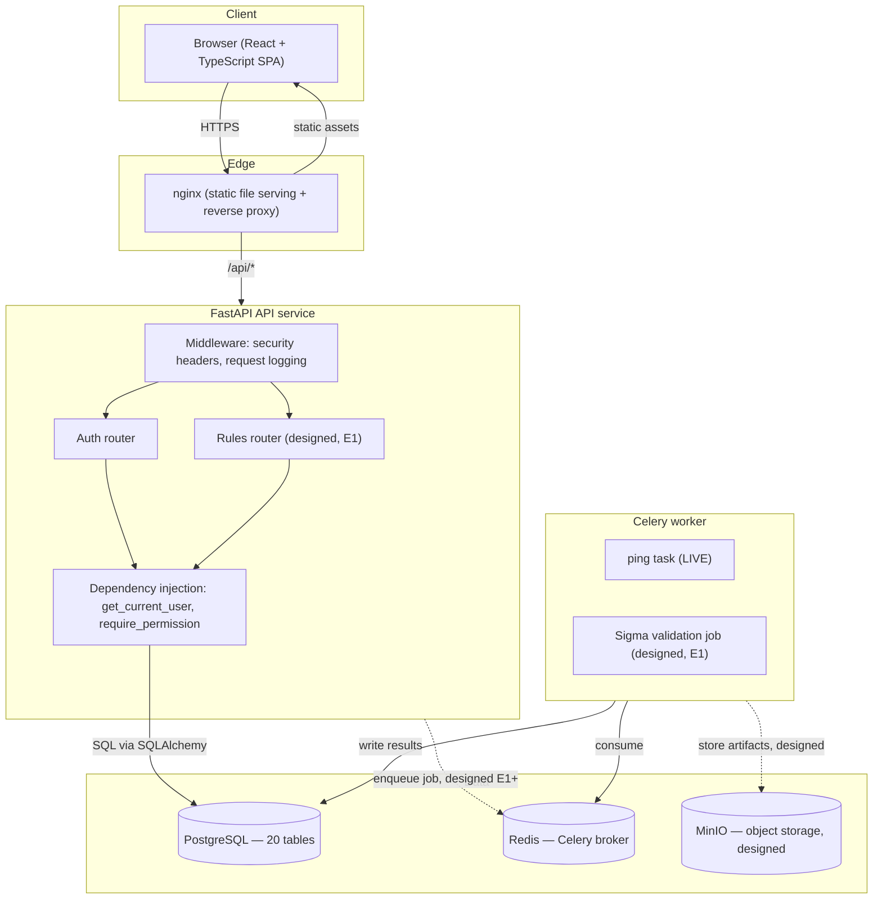
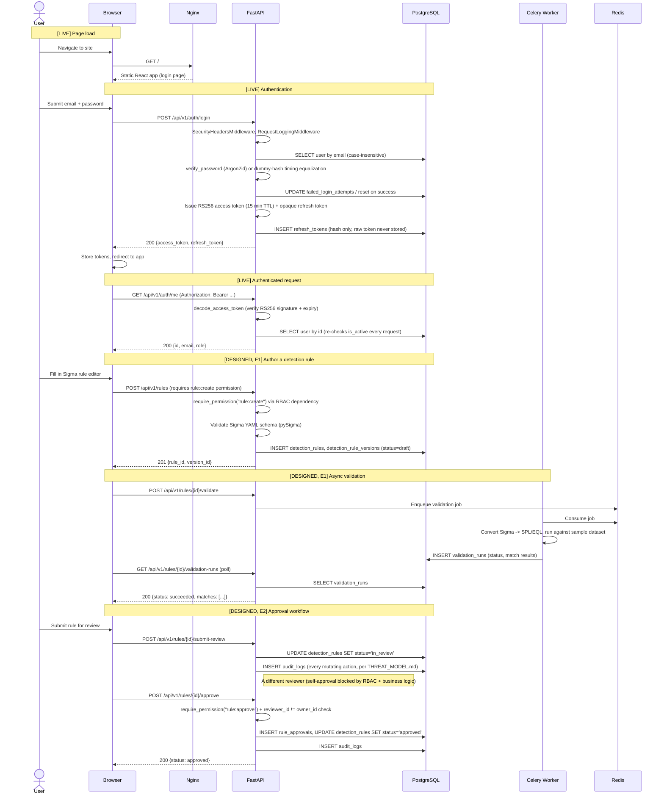
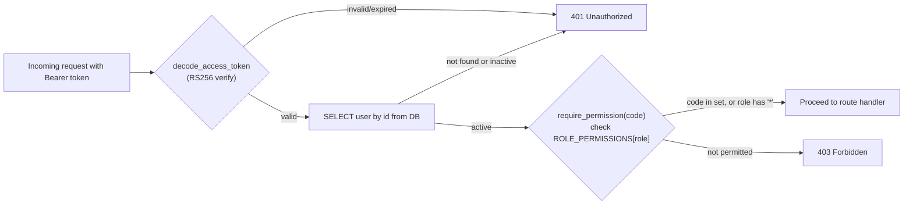

# Architecture Walkthrough: From Browser to Stored Detection Rule

This traces the complete target request lifecycle — from a user opening
the website to a detection rule being stored — as designed across the full
roadmap (`docs/ROADMAP.md`). It is **not** a description of only what's
built today. Each section is explicitly marked **[LIVE — E0]** for what
exists and is tested right now, or **[DESIGNED — not yet built]** for what
the architecture specifies but hasn't been implemented. Mixing these
without marking them is exactly the kind of overclaiming this project's
own release audit (`RELEASE_CHECKLIST.md`) exists to catch.

## 1. Component overview

**[LIVE — E0]**: Browser → nginx → FastAPI (Auth router only) → PostgreSQL
(auth tables only). Celery worker consumes from Redis and runs one real
task (`ping`) proving the broker round-trip, but nothing in the API
currently enqueues work to it — see `docs/subsystems/auth/DESIGN_DECISIONS.md`
and `RELEASE_CHECKLIST.md` for why the API service doesn't depend on Redis
in this release.

## 2. Full request lifecycle: opening the site through a stored rule

## 3. Authorization: how a request is allowed or denied

The `is_active` re-check on every request (not just at token issuance) is
deliberate: a deactivated user's access is cut off within one request, even
though the JWT itself remains cryptographically valid until its 15-minute
TTL expires. Full reasoning in `docs/subsystems/auth/DESIGN_DECISIONS.md`.

## 4. Logging and observability

**[LIVE — E0]**: `RequestLoggingMiddleware` attaches a request ID
(contextvar-scoped) to every log line for the duration of a request;
`JsonFormatter` emits structured JSON logs suitable for ingestion by a real
log pipeline. `/healthz` (liveness, touches nothing) and `/readyz`
(readiness, checks the real database connection, returns 503 rather than
crashing if unreachable) are both live and tested.

**[DESIGNED, E4/E5]**: Centralized log aggregation, `/metrics` (Prometheus)
endpoint, and AI-interaction-specific audit logging (`ai_interactions`
table exists in the schema, unused until E4).

## 5. Security controls active on every request today

- `SecurityHeadersMiddleware`: sets standard hardening headers on every
  response
- RFC 7807 (`problem+json`) structured error responses — no stack traces
  or internal details leaked to the client
- CORS restricted to the configured frontend origin (dev default:
  `http://localhost:5173`)
- Every route requiring authentication goes through the same
  `get_current_user` → `require_permission` chain — there is exactly one
  place authorization logic lives, not one per route

## What this walkthrough is not

It is not a claim that rule authoring, validation, or approval work today
— they're marked **[DESIGNED]** above precisely because they don't. See
`RELEASE_REPORT.md` for the complete, current-state answer to "what is
implemented today."
