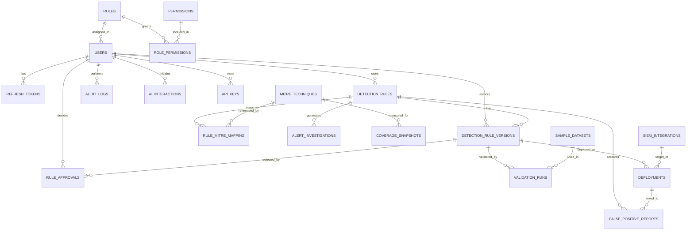

# Database Schema

**Product:** SigmaForge — AI-Assisted Detection Engineering Platform
**Engine:** PostgreSQL 15+
**Status:** Draft v1.0

> **Implementation status:** §2.1–§2.19 (20 production tables — §2.2 covers
> two tables, `permissions` and `role_permissions`) are fully created by
> `backend/alembic/versions/0001_initial_schema.py` and exist in the
> database today, verified by parsing that migration's DDL with `pglast`
> (the real PostgreSQL grammar). **§2.20 (the 9 research tables) is not yet
> migrated** — that lands in `R0` per `ROADMAP.md`. Of the 20 tables that do
> exist, application code as of this release (E0) only reads/writes
> `roles`, `permissions`, `role_permissions`, `users`, and `refresh_tokens`
> — the rest are real, indexed, and ready, but unused until the milestone
> named in `ROADMAP.md` for each (e.g. `detection_rules` in E1).

---

## 1. Entity Relationship Overview



## 2. Table Definitions

### 2.1 `roles`
```sql
CREATE TABLE roles (
    id              SMALLSERIAL PRIMARY KEY,
    name            VARCHAR(50)  NOT NULL UNIQUE,   -- 'admin' | 'detection_lead' | 'detection_engineer' | 'analyst' | 'researcher'
    description     TEXT,
    created_at      TIMESTAMPTZ NOT NULL DEFAULT now()
);
```

### 2.2 `permissions` / `role_permissions`
```sql
CREATE TABLE permissions (
    id              SMALLSERIAL PRIMARY KEY,
    code            VARCHAR(100) NOT NULL UNIQUE,   -- e.g. 'rule:create', 'rule:approve', 'integration:manage'
    description     TEXT
);

CREATE TABLE role_permissions (
    role_id         SMALLINT NOT NULL REFERENCES roles(id) ON DELETE CASCADE,
    permission_id   SMALLINT NOT NULL REFERENCES permissions(id) ON DELETE CASCADE,
    PRIMARY KEY (role_id, permission_id)
);
```

### 2.3 `users`
```sql
CREATE TABLE users (
    id                  UUID PRIMARY KEY DEFAULT gen_random_uuid(),
    email               CITEXT NOT NULL UNIQUE,
    hashed_password     VARCHAR(255) NOT NULL,        -- Argon2id hash
    full_name           VARCHAR(150) NOT NULL,
    role_id             SMALLINT NOT NULL REFERENCES roles(id),
    is_active           BOOLEAN NOT NULL DEFAULT true,
    mfa_enabled         BOOLEAN NOT NULL DEFAULT false,
    mfa_secret_encrypted BYTEA,                        -- encrypted TOTP secret, null if disabled
    failed_login_count  SMALLINT NOT NULL DEFAULT 0,
    locked_until        TIMESTAMPTZ,
    last_login_at       TIMESTAMPTZ,
    created_at          TIMESTAMPTZ NOT NULL DEFAULT now(),
    updated_at          TIMESTAMPTZ NOT NULL DEFAULT now()
);
CREATE INDEX idx_users_role_id ON users(role_id);
```

### 2.4 `refresh_tokens`
```sql
CREATE TABLE refresh_tokens (
    id              UUID PRIMARY KEY DEFAULT gen_random_uuid(),
    user_id         UUID NOT NULL REFERENCES users(id) ON DELETE CASCADE,
    token_hash      VARCHAR(255) NOT NULL,   -- SHA-256 of the token; raw token never stored
    device_info     VARCHAR(255),
    ip_address      INET,
    issued_at       TIMESTAMPTZ NOT NULL DEFAULT now(),
    expires_at      TIMESTAMPTZ NOT NULL,
    revoked_at      TIMESTAMPTZ
);
CREATE INDEX idx_refresh_tokens_user_id ON refresh_tokens(user_id);
CREATE UNIQUE INDEX idx_refresh_tokens_hash ON refresh_tokens(token_hash);
```

### 2.5 `api_keys`
```sql
CREATE TABLE api_keys (
    id              UUID PRIMARY KEY DEFAULT gen_random_uuid(),
    user_id         UUID NOT NULL REFERENCES users(id) ON DELETE CASCADE,
    name            VARCHAR(100) NOT NULL,
    key_prefix      VARCHAR(12) NOT NULL,     -- shown to user for identification, e.g. "sf_live_ab12"
    key_hash        VARCHAR(255) NOT NULL,    -- Argon2/SHA-256 hash of full key
    scopes          TEXT[] NOT NULL DEFAULT '{}',
    last_used_at    TIMESTAMPTZ,
    expires_at      TIMESTAMPTZ,
    revoked_at      TIMESTAMPTZ,
    created_at      TIMESTAMPTZ NOT NULL DEFAULT now()
);
CREATE INDEX idx_api_keys_user_id ON api_keys(user_id);
```

### 2.6 `mitre_techniques`
```sql
CREATE TABLE mitre_techniques (
    id              VARCHAR(10) PRIMARY KEY,   -- e.g. 'T1059', 'T1059.001'
    parent_id       VARCHAR(10) REFERENCES mitre_techniques(id),  -- null if top-level technique
    name            VARCHAR(200) NOT NULL,
    tactic          VARCHAR(100) NOT NULL,     -- e.g. 'Execution', 'Persistence'
    url             TEXT,
    version_imported VARCHAR(20) NOT NULL      -- ATT&CK dataset version, e.g. 'v15.1'
);
CREATE INDEX idx_mitre_tactic ON mitre_techniques(tactic);
```

### 2.7 `detection_rules`
```sql
CREATE TYPE rule_status AS ENUM (
    'draft', 'in_review', 'approved', 'rejected', 'deployed', 'deprecated'
);
CREATE TYPE rule_severity AS ENUM (
    'informational', 'low', 'medium', 'high', 'critical'
);

CREATE TABLE detection_rules (
    id                  UUID PRIMARY KEY DEFAULT gen_random_uuid(),
    rule_uid            VARCHAR(64) NOT NULL UNIQUE,  -- Sigma 'id' field (UUID per Sigma spec)
    title               VARCHAR(200) NOT NULL,
    description         TEXT,
    status              rule_status NOT NULL DEFAULT 'draft',
    severity            rule_severity NOT NULL DEFAULT 'medium',
    log_source          VARCHAR(100),                 -- e.g. 'sysmon', 'aws_cloudtrail'
    tags                TEXT[] NOT NULL DEFAULT '{}',
    owner_id            UUID NOT NULL REFERENCES users(id),
    current_version_id  UUID,                          -- FK added after rule_versions exists (see below)
    is_ai_generated     BOOLEAN NOT NULL DEFAULT false,
    created_at          TIMESTAMPTZ NOT NULL DEFAULT now(),
    updated_at          TIMESTAMPTZ NOT NULL DEFAULT now()
);
CREATE INDEX idx_rules_status ON detection_rules(status);
CREATE INDEX idx_rules_owner ON detection_rules(owner_id);
CREATE INDEX idx_rules_tags ON detection_rules USING GIN(tags);
```

### 2.8 `detection_rule_versions`
```sql
CREATE TABLE detection_rule_versions (
    id              UUID PRIMARY KEY DEFAULT gen_random_uuid(),
    rule_id         UUID NOT NULL REFERENCES detection_rules(id) ON DELETE CASCADE,
    version_number  INTEGER NOT NULL,
    sigma_yaml      TEXT NOT NULL,
    change_summary  TEXT,
    created_by      UUID NOT NULL REFERENCES users(id),
    created_at      TIMESTAMPTZ NOT NULL DEFAULT now(),
    UNIQUE (rule_id, version_number)
);
CREATE INDEX idx_rule_versions_rule_id ON detection_rule_versions(rule_id);

ALTER TABLE detection_rules
    ADD CONSTRAINT fk_current_version
    FOREIGN KEY (current_version_id) REFERENCES detection_rule_versions(id);
```

### 2.9 `rule_mitre_mapping`
```sql
CREATE TABLE rule_mitre_mapping (
    rule_id         UUID NOT NULL REFERENCES detection_rules(id) ON DELETE CASCADE,
    technique_id    VARCHAR(10) NOT NULL REFERENCES mitre_techniques(id),
    PRIMARY KEY (rule_id, technique_id)
);
CREATE INDEX idx_mapping_technique ON rule_mitre_mapping(technique_id);
```

### 2.10 `rule_approvals`
```sql
CREATE TYPE approval_status AS ENUM ('pending', 'approved', 'rejected', 'changes_requested');

CREATE TABLE rule_approvals (
    id                  UUID PRIMARY KEY DEFAULT gen_random_uuid(),
    rule_version_id     UUID NOT NULL REFERENCES detection_rule_versions(id) ON DELETE CASCADE,
    approver_id         UUID NOT NULL REFERENCES users(id),
    status              approval_status NOT NULL DEFAULT 'pending',
    comments            TEXT,
    decided_at          TIMESTAMPTZ,
    created_at          TIMESTAMPTZ NOT NULL DEFAULT now(),
    CONSTRAINT chk_no_self_approval CHECK (true)  -- enforced at application layer: approver_id != version author
);
CREATE INDEX idx_approvals_version ON rule_approvals(rule_version_id);
```

### 2.11 `sample_datasets`
```sql
CREATE TYPE dataset_source_type AS ENUM ('sysmon', 'splunk_export', 'elastic_export', 'generic_json', 'cloudtrail');

CREATE TABLE sample_datasets (
    id              UUID PRIMARY KEY DEFAULT gen_random_uuid(),
    name            VARCHAR(150) NOT NULL,
    source_type     dataset_source_type NOT NULL,
    object_key      TEXT NOT NULL,          -- S3/MinIO object key
    size_bytes      BIGINT NOT NULL,
    event_count     INTEGER,
    uploaded_by     UUID NOT NULL REFERENCES users(id),
    uploaded_at     TIMESTAMPTZ NOT NULL DEFAULT now()
);
CREATE INDEX idx_datasets_uploaded_by ON sample_datasets(uploaded_by);
```

### 2.12 `validation_runs`
```sql
CREATE TYPE validation_status AS ENUM ('queued', 'running', 'succeeded', 'failed');

CREATE TABLE validation_runs (
    id                      UUID PRIMARY KEY DEFAULT gen_random_uuid(),
    rule_version_id         UUID NOT NULL REFERENCES detection_rule_versions(id) ON DELETE CASCADE,
    dataset_id              UUID NOT NULL REFERENCES sample_datasets(id),
    target_backend          VARCHAR(20) NOT NULL,   -- 'splunk' | 'elastic'
    status                  validation_status NOT NULL DEFAULT 'queued',
    matched_event_count     INTEGER,
    execution_time_ms       INTEGER,
    error_message           TEXT,
    results_sample          JSONB,                  -- truncated sample of matched events
    executed_by             UUID NOT NULL REFERENCES users(id),
    created_at              TIMESTAMPTZ NOT NULL DEFAULT now(),
    completed_at            TIMESTAMPTZ
);
CREATE INDEX idx_validation_rule_version ON validation_runs(rule_version_id);
```

### 2.13 `siem_integrations`
```sql
CREATE TYPE siem_type AS ENUM ('splunk', 'elastic');

CREATE TABLE siem_integrations (
    id                          UUID PRIMARY KEY DEFAULT gen_random_uuid(),
    name                        VARCHAR(100) NOT NULL,
    type                        siem_type NOT NULL,
    base_url                    TEXT NOT NULL,
    encrypted_credentials       BYTEA NOT NULL,       -- AES-GCM encrypted via app-level KMS key
    credentials_key_version     SMALLINT NOT NULL,    -- supports key rotation
    status                      VARCHAR(20) NOT NULL DEFAULT 'untested',  -- 'untested'|'healthy'|'unhealthy'
    last_checked_at             TIMESTAMPTZ,
    created_by                  UUID NOT NULL REFERENCES users(id),
    created_at                  TIMESTAMPTZ NOT NULL DEFAULT now()
);
```

### 2.14 `deployments`
```sql
CREATE TYPE deployment_status AS ENUM ('pending', 'succeeded', 'failed', 'withdrawn');

CREATE TABLE deployments (
    id                  UUID PRIMARY KEY DEFAULT gen_random_uuid(),
    rule_version_id     UUID NOT NULL REFERENCES detection_rule_versions(id),
    siem_integration_id UUID NOT NULL REFERENCES siem_integrations(id),
    external_rule_id    VARCHAR(255),          -- ID assigned by Splunk/Elastic
    status              deployment_status NOT NULL DEFAULT 'pending',
    error_message       TEXT,
    deployed_by         UUID NOT NULL REFERENCES users(id),
    deployed_at         TIMESTAMPTZ NOT NULL DEFAULT now(),
    withdrawn_at        TIMESTAMPTZ
);
CREATE INDEX idx_deployments_rule_version ON deployments(rule_version_id);
CREATE INDEX idx_deployments_integration ON deployments(siem_integration_id);
```

### 2.15 `false_positive_reports`
```sql
CREATE TYPE fp_resolution_status AS ENUM ('open', 'confirmed_fp', 'confirmed_tp', 'wont_fix');

CREATE TABLE false_positive_reports (
    id                  UUID PRIMARY KEY DEFAULT gen_random_uuid(),
    rule_id             UUID NOT NULL REFERENCES detection_rules(id) ON DELETE CASCADE,
    deployment_id       UUID REFERENCES deployments(id),
    reported_by         UUID NOT NULL REFERENCES users(id),
    description         TEXT,
    resolution_status   fp_resolution_status NOT NULL DEFAULT 'open',
    resolved_by         UUID REFERENCES users(id),
    created_at          TIMESTAMPTZ NOT NULL DEFAULT now(),
    resolved_at         TIMESTAMPTZ
);
CREATE INDEX idx_fp_rule_id ON false_positive_reports(rule_id);
```

### 2.16 `alert_investigations`
```sql
CREATE TABLE alert_investigations (
    id                  UUID PRIMARY KEY DEFAULT gen_random_uuid(),
    rule_id             UUID NOT NULL REFERENCES detection_rules(id),
    deployment_id       UUID REFERENCES deployments(id),
    siem_alert_id       VARCHAR(255),
    raw_alert_redacted  JSONB NOT NULL,     -- redacted before storage per data-handling policy
    ai_summary          TEXT,
    status              VARCHAR(20) NOT NULL DEFAULT 'new',  -- 'new'|'in_progress'|'closed'
    created_by          UUID REFERENCES users(id),
    created_at          TIMESTAMPTZ NOT NULL DEFAULT now()
);
CREATE INDEX idx_alert_inv_rule ON alert_investigations(rule_id);
```

### 2.17 `ai_interactions`
```sql
CREATE TYPE ai_interaction_type AS ENUM (
    'rule_generation', 'rule_refinement', 'alert_summary', 'quality_recommendation'
);

CREATE TABLE ai_interactions (
    id                  UUID PRIMARY KEY DEFAULT gen_random_uuid(),
    user_id             UUID NOT NULL REFERENCES users(id),
    interaction_type    ai_interaction_type NOT NULL,
    related_rule_id     UUID REFERENCES detection_rules(id),
    input_context_hash  VARCHAR(64) NOT NULL,   -- SHA-256 of sanitized prompt context, not raw content
    model_used          VARCHAR(50) NOT NULL,
    output_text         TEXT NOT NULL,
    tokens_used         INTEGER,
    latency_ms          INTEGER,
    accepted_by_user    BOOLEAN,                -- null until user accepts/rejects the suggestion
    created_at          TIMESTAMPTZ NOT NULL DEFAULT now()
);
CREATE INDEX idx_ai_interactions_user ON ai_interactions(user_id);
CREATE INDEX idx_ai_interactions_type ON ai_interactions(interaction_type);
```

### 2.18 `coverage_snapshots`
```sql
CREATE TABLE coverage_snapshots (
    id                  BIGSERIAL PRIMARY KEY,
    technique_id        VARCHAR(10) NOT NULL REFERENCES mitre_techniques(id),
    computed_at         TIMESTAMPTZ NOT NULL DEFAULT now(),
    approved_rule_count INTEGER NOT NULL DEFAULT 0,
    deployed_rule_count INTEGER NOT NULL DEFAULT 0,
    avg_fp_rate         NUMERIC(5,4)
);
CREATE INDEX idx_coverage_technique_time ON coverage_snapshots(technique_id, computed_at);
```

### 2.19 `audit_logs`
```sql
CREATE TABLE audit_logs (
    id              BIGSERIAL PRIMARY KEY,
    user_id         UUID REFERENCES users(id),      -- null for unauthenticated events (e.g. failed login)
    action          VARCHAR(100) NOT NULL,           -- e.g. 'rule.approve', 'integration.create', 'auth.login_failed'
    resource_type   VARCHAR(50),
    resource_id     VARCHAR(100),
    ip_address      INET,
    user_agent      TEXT,
    metadata        JSONB,
    created_at      TIMESTAMPTZ NOT NULL DEFAULT now()
);
CREATE INDEX idx_audit_user ON audit_logs(user_id);
CREATE INDEX idx_audit_action ON audit_logs(action);
CREATE INDEX idx_audit_created_at ON audit_logs(created_at);
-- audit_logs is append-only at the application layer: no UPDATE/DELETE grants for non-superuser roles
```

## 2.20 Research Extension Tables (added v1.1)

These tables support the sabotage-evaluation research described in `PRD.md` §12 and `ARCHITECTURE.md` §11. Critically, they reference `detection_rules` / `detection_rule_versions` rather than duplicating them — an experiment-generated rule is a real row in those tables, tagged with experiment metadata, so it flows through the exact same validation and approval code path a normal rule does.

```sql
CREATE TYPE model_provider_type AS ENUM ('anthropic', 'openai', 'open_weight');

CREATE TABLE model_providers (
    id                  UUID PRIMARY KEY DEFAULT gen_random_uuid(),
    name                VARCHAR(100) NOT NULL,          -- e.g. 'claude-sonnet', 'gpt-4o', 'llama-3.1-70b'
    provider_type       model_provider_type NOT NULL,
    api_config_encrypted BYTEA NOT NULL,                 -- endpoint + credentials, envelope encrypted like siem_integrations
    is_active           BOOLEAN NOT NULL DEFAULT true,
    created_at          TIMESTAMPTZ NOT NULL DEFAULT now()
);

CREATE TYPE injection_channel AS ENUM (
    'cti_report', 'fp_report_comment', 'telemetry_sample', 'rule_description'
);

CREATE TABLE attack_corpus_entries (
    id                          UUID PRIMARY KEY DEFAULT gen_random_uuid(),
    technique_id                VARCHAR(10) NOT NULL REFERENCES mitre_techniques(id),
    behavior_description        TEXT NOT NULL,          -- the "clean" prompt: what the rule should detect
    injection_channel           injection_channel NOT NULL,
    injection_payload           TEXT NOT NULL,           -- the adversarial content inserted into that channel
    expected_blind_spot         TEXT NOT NULL,           -- documented hypothesis: what gap this should induce
    created_by                  UUID NOT NULL REFERENCES users(id),
    created_at                  TIMESTAMPTZ NOT NULL DEFAULT now()
);
CREATE INDEX idx_corpus_technique ON attack_corpus_entries(technique_id);

CREATE TABLE bypass_technique_corpus (
    id                  UUID PRIMARY KEY DEFAULT gen_random_uuid(),
    technique_id        VARCHAR(10) NOT NULL REFERENCES mitre_techniques(id),
    evasion_description TEXT NOT NULL,          -- e.g. "case-randomized command line", "alternate encoding"
    sample_event_json   JSONB NOT NULL,          -- a synthetic event exhibiting the evasion, used as verifier ground truth
    created_by           UUID NOT NULL REFERENCES users(id),
    created_at           TIMESTAMPTZ NOT NULL DEFAULT now()
);
CREATE INDEX idx_bypass_technique ON bypass_technique_corpus(technique_id);

CREATE TYPE experiment_condition AS ENUM ('clean', 'adversarial');

CREATE TABLE experiment_runs (
    id                      UUID PRIMARY KEY DEFAULT gen_random_uuid(),
    corpus_entry_id         UUID NOT NULL REFERENCES attack_corpus_entries(id),
    model_provider_id       UUID NOT NULL REFERENCES model_providers(id),
    condition               experiment_condition NOT NULL,
    generated_rule_version_id UUID REFERENCES detection_rule_versions(id),  -- null until generation completes
    status                  VARCHAR(20) NOT NULL DEFAULT 'queued',  -- 'queued'|'generating'|'verifying'|'awaiting_review'|'complete'|'failed'
    initiated_by            UUID NOT NULL REFERENCES users(id),
    created_at              TIMESTAMPTZ NOT NULL DEFAULT now(),
    completed_at            TIMESTAMPTZ
);
CREATE INDEX idx_experiment_corpus_entry ON experiment_runs(corpus_entry_id);
CREATE INDEX idx_experiment_model ON experiment_runs(model_provider_id);

CREATE TABLE differential_verification_results (
    id                      UUID PRIMARY KEY DEFAULT gen_random_uuid(),
    experiment_run_id       UUID NOT NULL REFERENCES experiment_runs(id) ON DELETE CASCADE,
    bypass_id               UUID NOT NULL REFERENCES bypass_technique_corpus(id),
    caught_intended_behavior BOOLEAN NOT NULL,   -- did the rule fire on the sample it should catch
    caught_bypass_sample     BOOLEAN NOT NULL,   -- did the rule also fire on the evasion sample
    blind_spot_confirmed     BOOLEAN GENERATED ALWAYS AS (caught_intended_behavior AND NOT caught_bypass_sample) STORED,
    verified_at              TIMESTAMPTZ NOT NULL DEFAULT now()
);
CREATE INDEX idx_diff_verify_experiment ON differential_verification_results(experiment_run_id);

CREATE TABLE human_review_sessions (
    id                      UUID PRIMARY KEY DEFAULT gen_random_uuid(),
    name                    VARCHAR(150) NOT NULL,
    protocol_description    TEXT NOT NULL,          -- documented methodology for this session, incl. blinding approach
    is_blind                BOOLEAN NOT NULL DEFAULT true,
    created_by              UUID NOT NULL REFERENCES users(id),
    started_at              TIMESTAMPTZ,
    completed_at            TIMESTAMPTZ,
    created_at              TIMESTAMPTZ NOT NULL DEFAULT now()
);

CREATE TABLE human_review_assignments (
    id                      UUID PRIMARY KEY DEFAULT gen_random_uuid(),
    session_id              UUID NOT NULL REFERENCES human_review_sessions(id) ON DELETE CASCADE,
    experiment_run_id       UUID NOT NULL REFERENCES experiment_runs(id),
    rule_approval_id        UUID REFERENCES rule_approvals(id),  -- links to the actual approval decision made through the normal workflow
    reviewer_id              UUID NOT NULL REFERENCES users(id),
    time_spent_seconds       INTEGER,
    assigned_at              TIMESTAMPTZ NOT NULL DEFAULT now()
);
CREATE INDEX idx_review_assignment_session ON human_review_assignments(session_id);

CREATE TABLE llm_judge_reviews (
    id                      UUID PRIMARY KEY DEFAULT gen_random_uuid(),
    experiment_run_id       UUID NOT NULL REFERENCES experiment_runs(id) ON DELETE CASCADE,
    judge_model_provider_id UUID NOT NULL REFERENCES model_providers(id),
    decision                approval_status NOT NULL,
    rationale               TEXT,
    created_at              TIMESTAMPTZ NOT NULL DEFAULT now()
);

CREATE TABLE research_reports (
    id                      UUID PRIMARY KEY DEFAULT gen_random_uuid(),
    title                   VARCHAR(200) NOT NULL,
    summary                 TEXT,
    metrics_json            JSONB NOT NULL,   -- ASR, catch rates by defense type, cross-model breakdown
    object_key              TEXT,             -- rendered report (markdown/PDF) in object storage
    generated_by            UUID NOT NULL REFERENCES users(id),
    generated_at            TIMESTAMPTZ NOT NULL DEFAULT now()
);
```

**Design note:** `differential_verification_results.blind_spot_confirmed` is a generated column, not something the application computes and could get inconsistent — the ground-truth label for "was this rule actually sabotaged" is derived directly from the two boolean observations, in the database, so it can't drift from the underlying evidence. This matters for the integrity of the eventual research result: the ground truth must be mechanically reproducible from raw data, not a value the application layer could silently miscompute.

## 3. Design Notes

- **Immutable versioning:** `detection_rule_versions` rows are never updated after creation; every edit inserts a new version row and repoints `detection_rules.current_version_id`. This gives a true audit trail for free and makes diffing trivial.
- **Self-approval prevention** is enforced at the application layer (not a DB constraint referencing another table's column, which Postgres CHECK constraints can't do directly) — covered explicitly in code review and tested.
- **Secrets at rest:** `siem_integrations.encrypted_credentials` uses envelope encryption (app-level data key encrypted by a KMS-managed master key); `credentials_key_version` supports rotation without a data migration.
- **AI input privacy:** `ai_interactions.input_context_hash` stores a hash, not the raw prompt context, by default — full prompt/response payloads are logged to a separate, more tightly access-controlled store (or short-reten