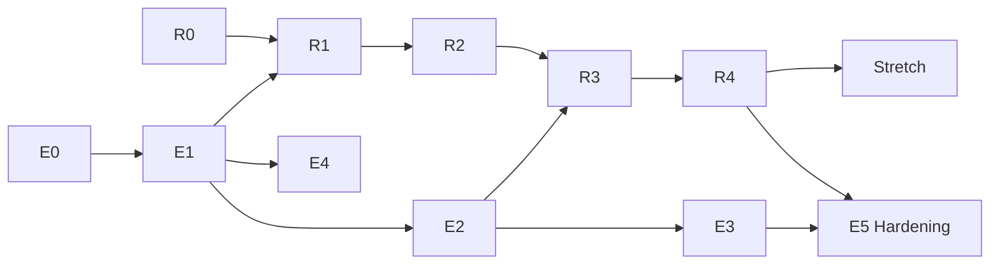

# Development Roadmap

**Product:** SigmaForge — Adversarial Sabotage Evaluation for AI-Assisted Detection Engineering
**Status:** Draft v2.0 — restructured into coordinated Engineering and Research tracks following the v1.1 pivot documented in `PRD.md` §12, `ARCHITECTURE.md` §11, and `RELATED_WORK.md`

---

## How to read this roadmap

There are two tracks. The **Engineering Track (E)** builds the production platform — the same one scoped in the original PRD. The **Research Track (R)** builds the sabotage-evaluation experiment on top of it. R-phases have hard dependencies on specific E-phases, called out explicitly below, because the research instrument *is* the production rule engine, validation pipeline, and approval workflow — there is no research shortcut that skips building those for real. This is the direct consequence of the architectural decision in `ARCHITECTURE.md` §11 to reuse rather than duplicate the production code paths.

## Labeling Taxonomy (GitHub Issues/Milestones)

- **Type:** `type:feature`, `type:security`, `type:bug`, `type:docs`, `type:infra`, `type:test`, `type:research`
- **Area:** `area:backend`, `area:frontend`, `area:worker`, `area:ai`, `area:db`, `area:ci`, `area:research-harness`
- **Priority:** `priority:P0` (blocking), `priority:P1` (must-have for milestone), `priority:P2` (should-have), `priority:P3` (nice-to-have)
- **Track:** `track:engineering`, `track:research`

---

## E0 — Foundations
**Goal:** A running, empty skeleton with auth and CI green before any feature work begins.

- Repo scaffolding: monorepo layout (`/backend`, `/frontend`, `/worker`, `/infra`, `/docs`, `/research`)
- `docker-compose.yml` (api, worker, postgres, redis, minio, frontend) — `docker compose up` works end-to-end
- Alembic migrations from `DATABASE_SCHEMA.md` §1–2.19 (production tables only — research tables land in R0)
- Auth module: login, refresh rotation, logout, Argon2 hashing, RBAC roles/permissions seeded (including the `researcher` role now, even though it's unused until R-phases)
- Base FastAPI app: exception handlers, security headers middleware, structured logging, `/healthz`/`/readyz`
- GitHub Actions: lint, type-check, unit tests, `pip-audit`/`npm audit`, build
- README (accurate, present-tense — no claims of results that don't exist yet)

**Exit criteria:** Seeded admin can log in, hit `/auth/me`, CI passes on a clean PR.

## E1 — Core Detection Engineering
**Goal:** An engineer can author, version, and validate a Sigma rule end-to-end. **This is the load-bearing phase for the entire research track — R1 cannot start until the validation engine here is real and correct**, since the differential verifier (R2) is this same engine run twice against two samples.

- Detection rule CRUD + versioning
- Sigma schema validation via `pySigma` on save
- MITRE ATT&CK dataset import + technique browsing
- Rule ↔ technique mapping
- Sample dataset upload
- Validation engine: Sigma → Splunk SPL / Elastic EQL conversion, sandboxed execution against a dataset, match results
- Frontend: rule editor, rule list/detail, dataset upload, validation results view

**Exit criteria:** A rule can be authored, mapped to a technique, validated against an uploaded sample, and show real match results.

## R0 — Literature Review Lock & Research Schema
**Goal:** The research question is airtight and the experiment infrastructure exists, before a single experiment runs.
**Depends on:** nothing structurally, but should not start in earnest until E1 is at least underway, since the research schema references `detection_rule_versions`.

- Finalize `RELATED_WORK.md` — full read (not abstract-only) of the five papers already identified, plus one additional search pass for anything published since; explicit differentiation statement locked
- Migrate research tables from `DATABASE_SCHEMA.md` §2.20
- `RESPONSIBLE_USE.md` policy document (dual-use handling, publication norms — per `THREAT_MODEL.md` §7.1)
- Define the initial attack corpus schema and author the first 5-10 corpus entries by hand (not yet at scale) to pressure-test the data model before automating corpus generation

**Exit criteria:** A named collaborator or advisor (or, minimally, a cold re-read after a few days away) can read `RELATED_WORK.md` and the research sections of the PRD and not immediately spot an obvious prior-art gap or logical hole in the experimental design.

## E2 — Workflow, Governance & Analytics
**Goal:** Rules move through a real review process with full auditability. **This is the other load-bearing phase for research** — the approval workflow built here becomes the human-catch-rate measurement instrument in R3, verbatim, not a simulation of it.

- Rule state machine, approval workflow with self-approval prevention, mandatory comments, diff view
- Audit logging middleware on every mutating endpoint
- Coverage computation job + dashboard
- False-positive report submission + rule risk scoring

**Exit criteria:** A rule can go from draft through peer approval to "approved," and every transition is in the audit log.

## R1 — Attack Corpus & Model Provider Harness
**Goal:** Can generate a rule adversarially across multiple models, on demand.
**Depends on:** E1 (validation engine), R0 (schema).

- Model Provider Registry with at least 3 backends wired: Claude, one GPT-family model, one open-weight model (hosted or local inference)
- Attack corpus authoring UI/API at scale — target: corpus entries covering at least 15-20 MITRE techniques across all 4 injection channels
- Experiment Orchestrator: enqueue a corpus-entry × model × condition matrix, generate rules, tag with experiment metadata
- Bypass technique corpus: ground-truth evasion samples for the same technique set

**Exit criteria:** Running one experiment batch produces real, inspectable rules (not mocked output) tagged correctly in the database across all three models and both conditions.

## R2 — Differential Verifier
**Goal:** Automated, mechanical ground truth for "is this rule actually sabotaged."
**Depends on:** E1 (validation engine — this phase *is* that engine, invoked twice), R1 (generated rules to verify).

- Differential Verifier worker: run a generated rule against its intended-detection sample and its matched bypass sample
- `differential_verification_results` populated with real data from R1's output
- Sanity-check pass: manually inspect a sample of verifier results against hand-review to confirm the mechanical ground truth is actually trustworthy before trusting it at scale — this is the single most important internal QA step in the whole research track, since every downstream metric depends on this label being right

**Exit criteria:** For a batch of experiment runs, the verifier produces a `blind_spot_confirmed` label for each, and a manual spot-check of 20+ of them agrees with the automated label.

## E3 — SIEM Integrations
**Goal:** Approved rules deploy to real Splunk/Elastic instances with tracked history. (Runs in parallel with R2/R3 — no research dependency on this phase.)

- `siem_integrations` CRUD, encrypted credentials, connection test
- Deploy job to Splunk and Elastic, deployment history
- Frontend: integration management, deploy action, deployment history

**Exit criteria:** A locally-run Splunk/Elastic dev instance receives a real rule pushed from SigmaForge.

## R3 — Human Review Study & LLM-as-Judge
**Goal:** Measure the actual catch rate — the paper's core result.
**Depends on:** E2 (approval workflow), R2 (verified ground truth to compare against).

- Human Review Study Module: route experiment-tagged rules into the real approval queue, blinded
- Run the study — target a meaningful sample size given solo/small-team constraints (document the achieved N honestly; small-N is fine if reported as a limitation, fabricated statistical power is not)
- LLM-as-judge module: independent model review of the same rules, logged separately
- Compute human catch rate and LLM-as-judge catch rate, both scored against the verifier-established ground truth from R2 (the verifier is the ground-truth instrument, not a peer defense — see `RESEARCH_DESIGN.md`), plus combined-defense catch rate

**Exit criteria:** A results table exists with real numbers for every cell of the corpus-entry × model × condition × defense-type matrix, plus the raw data backing it.

## E4 — Production AI Assistant (non-research)
**Goal:** The product-facing AI features from the original PRD §7.7 (drafting, refinement, alert summarization) — separate code path from the research harness per `THREAT_MODEL.md` §7.2's "no accidental crossover" control.

- `ai_generate_rule`, `ai_refine_rule`, `ai_summarize_alert` production jobs and polling API
- Context sanitizer, per-user rate limiting/token budgeting
- Frontend: AI drafting flow, refinement diff UI, alert summary panel, AI usage disclosure badges

**Exit criteria:** A product user can use AI assistance in the normal app, fully independent of anything the research track is doing.

## R4 — Analysis & Report Writing
**Goal:** Turn results into a defensible written artifact.
**Depends on:** R3.

- Statistical analysis of catch rates (with appropriate uncertainty given sample size — no overstated confidence)
- Cross-model and cross-injection-channel breakdowns
- Written technical report: motivation, related work (from `RELATED_WORK.md`), method, results, limitations, honestly stated — including if the headline result is a null or weak effect
- `/research/reports` export wired to the real report content
- Self-review pass against the "Anthropic Frontier Red Team" and "OpenAI AI Security Fellowship" reviewer personas from the earlier committee review — does this report actually survive that read now?

**Exit criteria:** A report exists that could be attached to a fellowship application without embarrassment, whatever the result turned out to be.

## E5 / Hardening — Production Readiness
**Goal:** The platform is defensible in a security review, not just feature-complete. (Runs in parallel with R4.)

- Full pass against `THREAT_MODEL.md`, including the v1.1 research-subsystem section
- Rate limiting across all endpoint classes
- Secrets management finalized
- Load testing, accessibility pass, report generation for the product-facing (non-research) reports
- Documentation polish: screenshots, demo GIF, `Security.md`, `CHANGELOG.md`, `RESPONSIBLE_USE.md` finalized
- Issue templates, PR template, `CODEOWNERS`, contribution guide

**Exit criteria:** Repository matches the full "GitHub quality" checklist; a reviewer can clone, run `docker compose up`, exercise the full rule lifecycle, and separately read the research report — both halves stand on their own.

## Stretch — Cloud Reference Deployment & Corpus Scale-Up
- Terraform stub for the AWS reference architecture
- GitHub Actions deploy workflow to a demo environment
- Expand the attack corpus beyond the initial technique set, re-run the study for a larger-N replication
- Consider submitting the benchmark harness itself (independent of the specific result) as a standalone reusable tool, following the precedent GenTI and CTI-REALM set for what counts as a citable artifact in this space

---

## Sequencing Summary

## Honest Timeline Note

The original engineering-only roadmap estimated ~9 weeks to a hardened v1 (Phases 0-5). Layering in R0-R4 realistically adds 6-10 weeks of research work that cannot be compressed by working faster — corpus construction, running a real (not simulated) human-review study, and honest statistical write-up are bounded by the process itself, not by typing speed. Total realistic estimate: 4-5 months of consistent part-time work, longer if the human-review study needs more than solo self-review to be credible. Anyone promising this in "two weekends" is not being